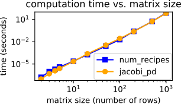

## Benchmarks

Average time (in seconds) to diagonalize randomly generated (nxn)
(normal-distributed) matrices (of floats) as a function of matrix size (n):



|Matrix Size (n) | jacobi_pd (s) | Numerical Recipes (s) |
|----------------|---------------|-----------------------|
|      2         |      9.54e-08 |              1.64e-07 |
|      3         |      4.95e-07 |              9.57e-07 |
|      4         |      1.24e-06 |              2.00e-06 |
|      5         |      2.53e-06 |              3.96e-06 |
|     10         |      2.22e-05 |              2.37e-05 |
|     20         |      2.35e-04 |              1.86e-04 |
|     50         |      0.00348  |              0.00259  |
|    100         |      0.0271   |              0.0192   |
|    200         |      0.232    |              0.25     |
|    500         |      5.39     |              5.36     |
|   1000         |     66.3      |             73.9      |

## Matrices used

Matrices of (32 bit) floats were generated with randomly
chosen eigenvectors.  The eigenvalues were selected from a
normal (Gaussian) distribution with mean 0 and variance 1.0.


## Hardware used

These times were measured on a single i5-4210U CPU core running at 1.70GHz.


## Code used
```
   cd tests/
   sed -i 's/double/float/' test_jacobi.cpp
   g++ -DNDEBUG -Ofast -I../include -o test_jacobi test_jacobi.cpp
   for N in 2 3 4 5 10 20 50 100 200 500 1000; do
     time ./test_jacobi $N 10 0 1 0 10
   done
```

*To make the test fair, the "test_jacobi.cpp" file was modified
slightly to disable the sorting of eigenvalues.
(I did this by invoking Diagonalize() with sort_criteria=DO_NOT_SORT.
I did this because the "Numerical Recipes" version of jacobi() was not sorting
the eigenvalues.  Either way, this probably did not make a significant
difference in the running times.)*

If I have time, I will compare this with other popular matrix
diagonalizers like Eigen and GSL.
